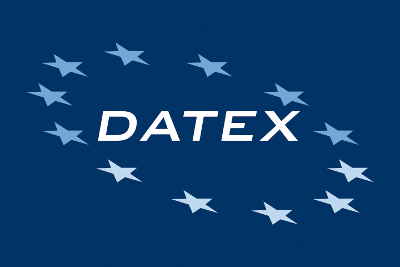

# DATEX Collaborative ITS Services and Traffic Management Plans Extension

Submitted by Fabrizio.Paoletti on Wednesday, 7 September, 2016 - 16:08

Status definition refers to ISO 14817
Recorded

Implemented Node
Parking Publications are part of DATEX 2.3 now

Extension object
Collaborative ITS Services and Traffic Management Plans

Extension information
This Model provides an extension to manage within current DATEX 2.3 release a way to echange Service Request and Service Feedack to be able to activate ITS Services available on external Service Provider platforms via DATEX II

Traffic Management Plans are modeled as specific Service to be implemented as Operator Action and devices setting such as VMSSignSetting or NetworkManagement
A comprehensive Use Case descrtiption to model Collaborative ITS Services in DATEX II enviroment is provided as 1st part, which is general Platform Indipendent description of this Use Case, which may be implemented  in current DATEX II Exchange platform via provided extension.

Traffic Management Plan Extension is derived from previous TMPs studies and proposed Models, as explained in Background Section of the document, harmonazing requirements and solutions provided to the DATEX organisation by various stakeholders.

This Model Extension and documentation had been the result of CIS Collaborative ITS Services Workitem in EIP Project DATEX Activity in 2015 which had been futther finalised in  DATEX TMG 2016.
 

Organization name
DATEX organisation

Contact name
Fabrizio Paoletti

Organization description
 DATEX Organisation manages DATEX II Specification by EU Commission funding through CEF Call.

Organization logo

Contact mail
fpaoletti@autostrade.it

Website
www.datex2.eu

Country/Region
EU

Centre type
TMC
