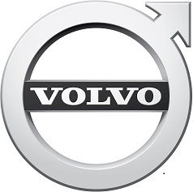

Submitted by hsegesten on Wednesday, 23 January, 2019 - 15:53

Status definition refers to ISO 14817
Draft

Extension object

The objective is publication of information on ongoing emergency vehicle assignments.
The primary extension objects are of class VehicleObstruction.

Extension information
This is a DATEXII extension model which extends the VehicleObstruction class to enable sending real-time information on ongoing emergency vehicle assignments.

This draft is being used in the NordicWay2 research project to build demos around the EmergencyVehicleAlert function.

Organization name
Volvo Car Corporation

Contact name
Henrik Segesten

Organization description
Volvo Cars is a premium car maker based in Sweden.

Organization logo

Contact mail
henrik.segesten@volvocars.com

Website
http://www.volvocars.com

Country/Region
Sweden

Centre type
other
